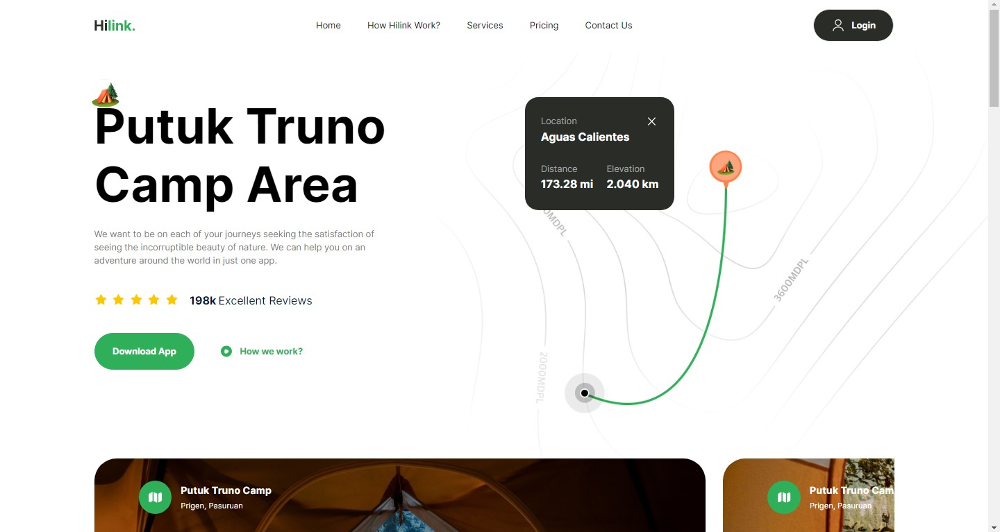
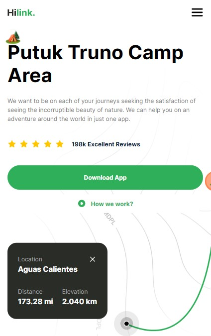
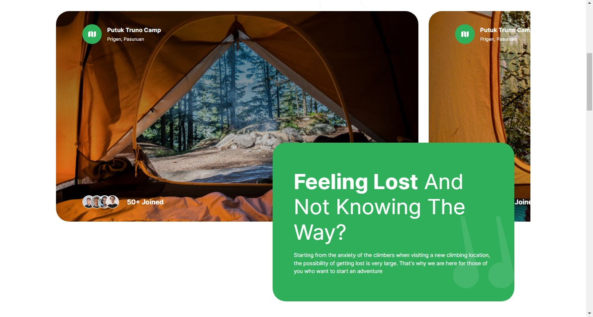
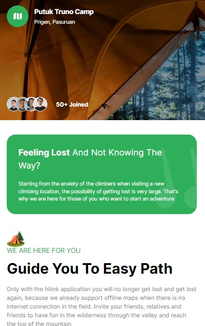
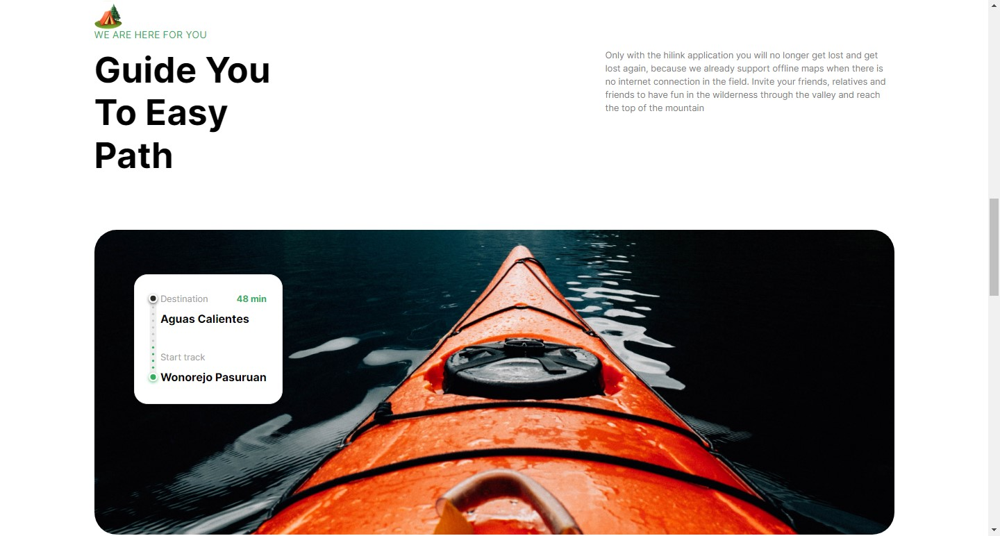
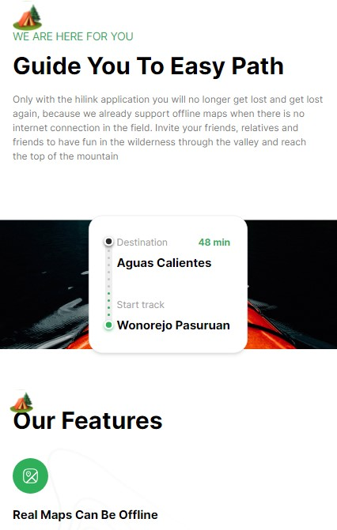
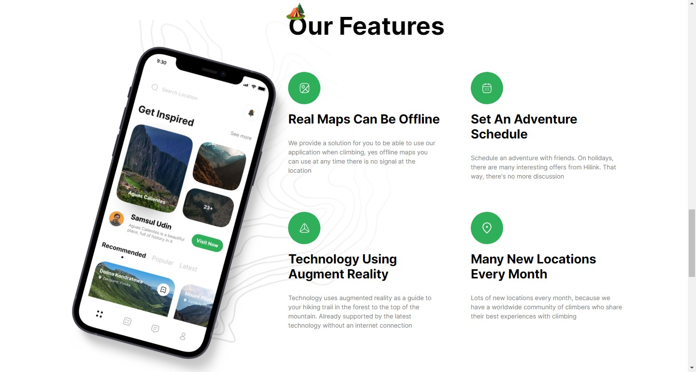
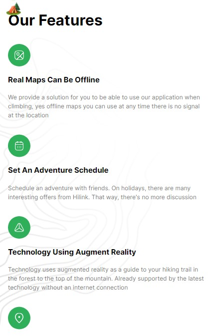
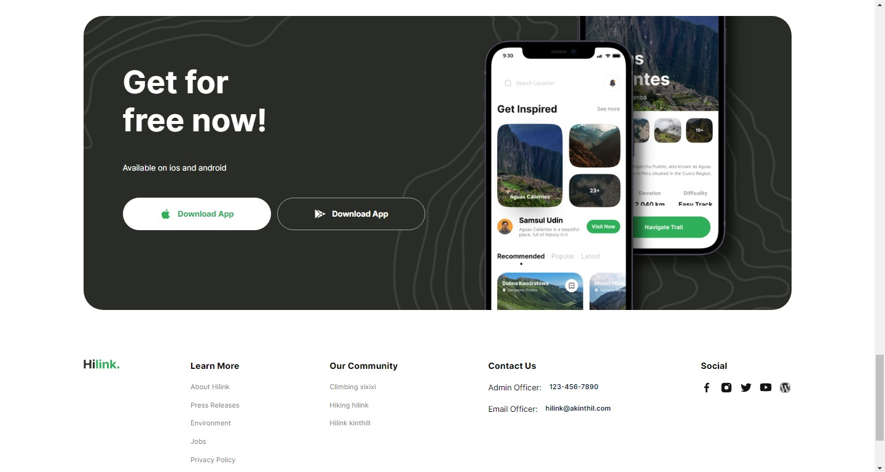
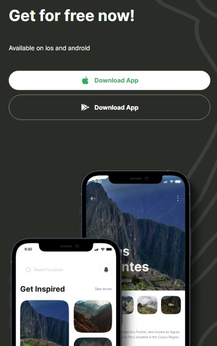

# CampTraveller

CampTraveller is an immersive camp traveling website designed to inspire and assist outdoor enthusiasts in discovering new camping destinations.
Developed using React and Next.js, this web application provides a user-friendly interface that seamlessly guides users to their desired camping places,
offering detailed information and directions for a memorable outdoor experience.

Hosted here: https://camp-traveller.netlify.app

## Technologies & Design Approach

Developed a responsive and user-friendly camping planner website using React and Next.js,
Implemented client-side routing and navigation using Next.js, enhancing the website's performance and SEO capabilities,
Conducted thorough testing and debugging to ensure the website's functionality and scored 99 on Lighthouse performance test and 100 for SEO test.

## Demo

